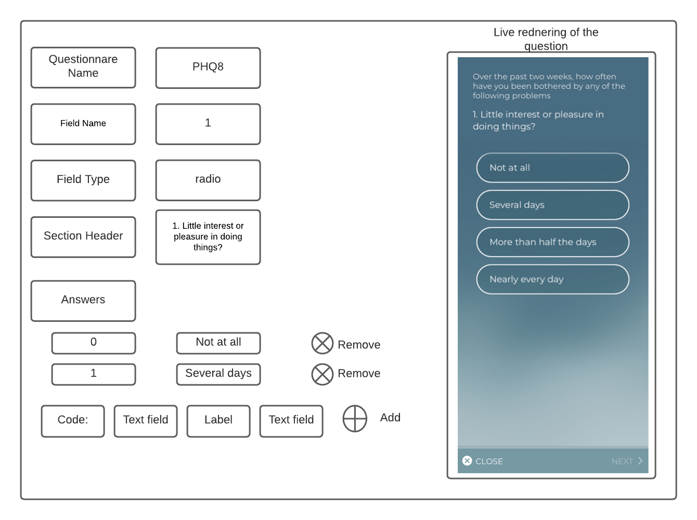

# RADAR-Base Google Summer of Code (GSoC) 2022

**RADAR-base (Remote Assessment of Disease And Relapses)** is an open source platform that leverages data from wearables and mobile technologies. Below is a list of project ideas.

## Project Ideas

### 1. aRMT Questionnaire and Protocol Generator

**Overview**: The [RADAR-base Active Mobile app](https://github.com/RADAR-base/RADAR-Questionnaire) (also known as Questionnaire app) is an app used to deliver questionnaires to participants in a study. The app takes in schedule protocols from a protocol repository ([RADAR-aRMT-Protocols](https://github.com/RADAR-base/RADAR-aRMT-protocols)) and questionnaires from a questionnaire definitions repository ([RADAR-REDCap-aRMT-Definitions](https://github.com/RADAR-base/RADAR-REDCap-aRMT-Definitions)).

**Current Status**: At the moment, the questionnaire and protocol JSON files are manually written or generated by external tools. This process is error-prone and less user-friendly.

### 1A. aRMT Questionnaire Generator

**Goals:** 
The goal of this project is to implement a UI which can be used to generate the questionnaire definition JSON file ([See example](https://github.com/RADAR-base/RADAR-REDCap-aRMT-Definitions/blob/master/questionnaires/phq8/phq8_armt.json)) based on user input and store this generated JSON file to be used by the app. The app should be able to adapt the input type user has chosen and render a sample question that would appear on the app (See wireframe below). We should be able to reuse the components created as part of the questionnaire app to build the live rendering. Questionnaire creation should also support branching logic which is supported by the app. See example input types [here](https://radar-base.atlassian.net/wiki/spaces/RAD/pages/38043668/Active+Questionnaire+App#ActiveQuestionnaireApp-Questionnaires%26Tasks).

**Sample Wireframe:** 

| Milestones                        | Description                                                                                                                                                                                                                                                                                                                              |
| -----------------------------| ----------------------------------------------------------------------------------------------------------------------------------------------------------------------------------------------------------------------------------------------------------------------------------------------------------------------------------------- |
| Implement authentication  | Implement authentication using authorization-code flow with Management Portal. See other frontend apps for sample e.g. [radar-app-config-frontend](https://github.com/RADAR-base/radar-app-config/tree/master/radar-app-config-frontend) |
| Implement Questionnaire builder similar to the wireframe | |
| Publish the questionnaire.json to a backend or to a github repository| Options: App-config-backend or github|

### 1B. aRMT Protocol Generator and Schedule Viewer

**Goals:** 
The goal of this project is to implement a UI which can be used to generate the protocol definition JSON file ([See example and docs here](https://radar-base.atlassian.net/wiki/spaces/RAD/pages/463241217/Protocol+Schedule)) based on user requirements (what questionnaires to be delivered and when). Optionally, if time permits this can be further extend to validate the protocol by generating schedule used on the enrolment-time of a participant. The RADAR Appserver has some existing scheduling functionality that can be extended to generate sample schedules.

| Milestones                        | Description                                                                                                                                                                                                                                                                                                                              |
| -----------------------------| ----------------------------------------------------------------------------------------------------------------------------------------------------------------------------------------------------------------------------------------------------------------------------------------------------------------------------------------- |
| Implement authentication  | Implement authentication using authorization-code flow with Management Portal. See other frontend apps for sample e.g. [radar-app-config-frontend](https://github.com/RADAR-base/radar-app-config/tree/master/radar-app-config-frontend) |
| Implement Protocol builder | Use the data of stored questionnaires and build protocol.json  |                                                                                                                                
| Publish the protocol.json to a backend or to a github repository| Options: App-config-backend or github|

**Required Skills:** Javascript, Typescript, Angular

**Difficulty:** Medium

**Expected Size:** 350-hour (Full time)

**Mentors**:  [mpgxvii](https://github.com/mpgxvii), [yatharth](https://github.com/yatharthranjan)

---

### 2A. RADAR-IoT Gateway support for MQTT protocol

**Overview:**
The [RADAR-IoT](https://github.com/RADAR-base/RADAR-IoT) is a lightweight, flexible, configurable and highly extensible framework for IoT devices (like a raspberry pi)
that allows for capturing sensor data (and potentially other devices) and consuming it in different ways
including sending it to the [RADAR-base mHealth platform](https://radar-base.org/) backend. The gateway framework is highly decoupled and extensible. The architecture is shown below.

**Current Status:**
The framework is currently in the Proof-Of-Concept (POC) stage and has been tested working in a staging environment. There are various integrations including [GrovePi](https://www.dexterindustries.com/grovepi/) and the array of [sensors](https://github.com/RADAR-base/RADAR-IoT/wiki/Supported-Sensors) compatible with it. For more information take a look at the [wiki](https://github.com/RADAR-base/RADAR-IoT/wiki).

We want to finalise the framework and make it production-ready.
This will involve working on core aspects of the framework like sensor states machines, M2M communication protocols and
implementing advanced visibility into the framework.

**Goals:**
| Goals                                                                                                   | Related Issues                                                                                                                                                             | Requirements                                                                                                                                                                                                                                                        |
| ------------------------------------------------------------------------------------------------------- | -------------------------------------------------------------------------------------------------------------------------------------------------------------------------- | ------------------------------------------------------------------------------------------------------------------------------------------------------------------------------------------------------------------------------------------------------------------- |
| Extend support for industry-standard IoT protocols.                                                     | [#21](https://github.com/RADAR-base/RADAR-IoT/issues/21)                                                                                                                   | - Implement an MQTT producer and a consumer to capture and utilise sensor data.  - Deploy an MQTT broker locally using docker and build and test the implementations using Mock sensor.                                                                          |

Apart from the goals above, the following general tasks are expected:

- General understanding of the RADAR-IoT framework architecture
- Understand the association of classes and modules in the code with the components in the architecture.
- Build and run the RADAR-IoT framework with Mock Sensor on your local machine.

**Skills:**

- _Must have:_ Python
- _Good-to-have:_ Kotlin/Java, Docker, Automation, IoT protocols like MQTT

**Difficulty:** Medium

**Expected Size:** 350-hour (Full time)

**Mentors**: [yatharth](https://github.com/yatharthranjan), [heet](https://github.com/Hsankesara)

### 2B. RADAR-IoT Gateway State Machine for sensors

**Overview:**

Another important addition to the above mentioned RADAR-IoT framework would be to add a state machine to capture and track sensor events lifecycle providing visibility and insight into the framework and sensors allowing for more robust fault isolation.

**Goals:**
| Goals                                                                                                   | Related Issues                                                                                                                                                             | Requirements                                                                                                                                                                                                                                                        |
| ------------------------------------------------------------------------------------------------------- | -------------------------------------------------------------------------------------------------------------------------------------------------------------------------- | ------------------------------------------------------------------------------------------------------------------------------------------------------------------------------------------------------------------------------------------------------------------- |
| Add support for sensor lifecycle events using State machines | [#5](https://github.com/RADAR-base/RADAR-IoT/issues/5), [#8](https://github.com/RADAR-base/RADAR-IoT/issues/8)                                                             | - Add State machine to the sensor to capture and track sensor events lifecycle.  - Publish device/sensor events and logs to pubsub system                                                                                                                        |

Apart from the goals above, the following general tasks are expected:

- General understanding of the RADAR-IoT framework architecture
- Understand the association of classes and modules in the code with the components in the architecture.
- Build and run the RADAR-IoT framework with Mock Sensor on your local machine.

**Skills:**

- _Must have:_ Python
- _Good-to-have:_ Kotlin/Java, Docker, Automation, IoT

**Difficulty:** Medium

**Expected Size:** 350-hour (Full time)

**Mentors**: [yatharth](https://github.com/yatharthranjan), [heet](https://github.com/Hsankesara)

---

### 3. Fitbit API Extension

**Overview:**
The [RADAR-REST-Connector](https://github.com/RADAR-base/RADAR-REST-Connector) contains a [Kafka Connect source connector](https://docs.confluent.io/home/connect/overview.html) for a general REST API, and one for Fitbit in particular. This allows for pulling the wearable data from Fitbit servers using their [Web API](https://dev.fitbit.com/build/reference/web-api/).

The connector currently already collects different data types including heart rate, steps, activity, and more. The solution is to implement additional extensions to the connector allowing for new data types to be collected. 

**Goals:**

| Goals                                                                                             | Related Issues                                                      | Requirements                                                                                                                                                                                                                                                                                                                                                                                                                                                                                                                                                                                                                                                                                                                                       |
| ------------------------------------------------------------------------------------------------- | ------------------------------------------------------------------- | -------------------------------------------------------------------------------------------------------------------------------------------------------------------------------------------------------------------------------------------------------------------------------------------------------------------------------------------------------------------------------------------------------------------------------------------------------------------------------------------------------------------------------------------------------------------------------------------------------------------------------------------------------------------------------------------------------------------------------------------------- |
| Add support for [Fitbit Nutrition API](https://dev.fitbit.com/build/reference/web-api/nutrition/) | [#91](https://github.com/RADAR-base/RADAR-REST-Connector/issues/91) | - Read the specifications provided by Fitbit  - Create [Schemas](https://github.com/RADAR-base/RADAR-Schemas) for the new data types  - Implement new [Config](https://github.com/RADAR-base/RADAR-REST-Connector/blob/master/kafka-connect-fitbit-source/src/main/java/org/radarbase/connect/rest/fitbit/FitbitRestSourceConnectorConfig.java), [Routes](https://github.com/RADAR-base/RADAR-REST-Connector/tree/master/kafka-connect-fitbit-source/src/main/java/org/radarbase/connect/rest/fitbit/route) and [Converters](https://github.com/RADAR-base/RADAR-REST-Connector/tree/master/kafka-connect-fitbit-source/src/main/java/org/radarbase/connect/rest/fitbit/converter) to pull and store these data types  - Add tests for new endpoints. |
| Extend timeseries data support for Heart Rate Variability, SpO2 and Breathing Rate                                           | [#95](https://github.com/RADAR-base/RADAR-REST-Connector/issues/95) | - Update [Schemas](https://github.com/RADAR-base/RADAR-Schemas) to include new Fields - Make updates to the existing Routes and Converters to include these new fields  - Create new Route and Converter wherever necessary  - Extend tests to support these new implementations.                                                                                          |

Apart from the goals above, the following general tasks are expected:

- General understanding of REST APIs, Apache Kafka and the Kafka Connect architecture
- Understand the association of classes and modules in the code with the components in the architecture.
- Understand the specification provided by Fitbit Web API and design implementations based on that.

**Skills:**

- _Must have:_ Java, REST API
- _Good-to-have:_ Docker, Kafka

**Difficulty:** Medium

**Expected Size:** 350-hour (Full time)

**Mentors**: [yatharth](https://github.com/yatharthranjan)

---

### 4. Grafana Dashboards for visualising the data in realtime

**Overview**: The platform uses [Grafana](https://grafana.com/) to visualise the data coming from the devices and apps. A TimescaleDB Kafka connector delivers both active and passive data from the Kafka topics to a TimescaleDB database. Data from the database is then used to visualise data completeness through various [dashboards in Grafana](https://github.com/RADAR-base/RADAR-Grafana). 

**Current Status**: Currently, the dashboards that have been created are specific to the studies running them (with specific devices and requirements). These dashboards are added to the [Kubernetes installation](https://github.com/RADAR-base/RADAR-Kubernetes/tree/main/etc/radar-grafana/dashboards/allprojects). For example, one dashboard is called "Fitbit Weartime", which shows the daily number of hours the participant wore the Fitbit device. However, not all studies may be using the Fitbit device. It would be helpful to generalise the dashboards and allow easy configurations.

**Dependencies:** Sample/Mock data will be necessary to create the graphs.

**Goal:**

| Goals | Related Issues | Requirements |
|---------------------------------------------------------------------------------------------------------|----------------------------------------------------------------------------------------------------------------------------------------------------------------------------|---------------------------------------------------------------------------------------------------------------------------------------------------------------------------------------------------------------------------------------------------------|
| General Grafana dashboard configurations | - | - The goal is to create different Grafana dashboard configurations for different data/devices and types of visualisations needed. This would make dashboard setup easier and quicker for different studies. This would also allow easy reuse of configurations across studies.

**Required Skills:** Grafana, TimescaleDB

**Good to have:** Go, Kafka, Kafka-connect

**Difficulty:** Easy

**Expected Size:** 175-hour (Half time)

**Mentors**: [heet](https://github.com/Hsankesara), [mpgxvii](https://github.com/mpgxvii), 

---

### 5. RADAR-Feature pipeline

**Overview:**

There is a rapidly growing interest in utilizing smartphones and wearables to remotely monitor patients with physical and mental disorders, which offers the potential to provide timely and personalized interventions. Yet, standardization, extraction, and exploration of relevant digital phenotypes (features derived from single or multiple remote monitoring data streams) are time- and effort-consuming. The RADAR-base platform offers off-the-shelf open-source capabilities for collecting these types of remote monitoring streams of data. Standardizing the pipeline for feature extraction and cataloguing will greatly facilitate and expedite the discovery of informative features, enabling feature reuse and comparison.

In [RADAR-pipeline](https://github.com/RADAR-base/radar-pipeline), we are working on an open-source feature extraction pipeline which is capable of processing and analysing raw data collected through smartphones and wearables. The applicable sensor modalities, as detailed by the RADAR-base platform schemas, include GPS, Bluetooth, phone and app usage, sleep, step count, heart rate and others.  We have shown through a [depression case study](https://kclpure.kcl.ac.uk/portal/en/publications/relationship-between-major-depression-symptom-severity-and-sleep-collected-using-a-wristband-wearable-device(e28ac77e-18f6-43b0-8f73-19da02024f23).html) the functionality and utility of the pipeline. The presented open-source library will reduce burdens for studies aiming to develop relevant digital biomarkers and encourage and facilitate reproducible research. It also provides a standardized framework for contributing new pipelines with an emphasis on reuse.

**Current Status:**

The framework is in development stage, and we are open to new and interesting ideas. We have a working module now and we in the process of finalizing the framework and make it production-ready.

**Goals:**
| Milestones                                         | Description                                                                                                                                             |
|----------------------------------------------------|---------------------------------------------------------------------------------------------------------------------------------------------------------|
| Extend the data reader library                     | - Extend data reading from remote server  - Add funtionality to read files in various formats such as Avro, json etc |
| Make feature processing more customizable          | Integrate parameter processing in features.                                                                                                             |
| Add feature summarization and visualization module |  - Add summarization library, which provides summary statistics of features.  - Implement support for open source visualization library                       |
| Develop module of reporting missing data           | Add a module that would report missing data.                                                                                                            |
| Add industry-wide used features                    | Implement industry-wide features used for mobility, heart rate, phone-interaction etc                                                                   |

**Skills:**

- _Must have:_  Python
- _Good-to-have:_ Pandas,  Python Standard Library, Apache Spark, Dask

**Difficulty:** Hard

**Expected Size:** 350-hour (Full time)

**Mentors**: [Pushkar Patel](https://github.com/thepushkarp), [Heet Sankesara](https://github.com/Hsankesara), [Amos Folarin](https://github.com/afolarin), [Shaoxiong Sun](https://github.com/rainybear)

---

### 6. pRMT plugins with data from Google Sleep API and Google Activity recognition API

**Overview**: The [RADAR-base Passive Mobile App (pRMT)](https://github.com/RADAR-base/radar-prmt-android) is the hub for collecting background sensor data and provides data streams from both on-phone sensors and the capability to collect data from a number of wearable devices. This application depends on plugins to collect information. New wearable devices can readily be connected to the passive app as plugins using a vendor SDK. In this project we want to extend pRMT support for [Google Sleep API](https://developers.google.com/location-context/sleep) data and [Google Activity recognition](https://developers.google.com/location-context/activity-recognition) data as separate plugins.

The Sleep API, a library powered by Google Play services allows apps to determine when the user goes to sleep and wakes up. The Sleep plugin should subscribe and get the updates via Google Sleep API.

The Activity Recognition API automatically detects activities by periodically reading short bursts of sensor data and processing them using machine learning models.

**Current Status**: Currently, project-supported plugins are listed in the plugins directory of [radar-commons-android]().

**Source Code**: https://github.com/RADAR-base/radar-prmt-android and https://github.com/RADAR-base/radar-commons-android

**Goals:**

| Milestones                                                                                                                        | Description                                                                                                                                                                                     |
|-----------------------------------------------------------------------------------------------------------------------------------|-------------------------------------------------------------------------------------------------------------------------------------------------------------------------------------------------|
| Create schemas to send data from Google Sleep API.                                                                                | Refer to [RADAR-Schemas](https://github.com/RADAR-base/RADAR-Schemas), create corresponding schemas and specification to send data from Google Sleep API to RADAR-base platform.                |
| [Create a new plugin](https://github.com/RADAR-base/radar-commons-android#creating-a-plugin) for Google Sleep API.                | Retrieve any detected sleep start/end times and send data to RADAR-base server. The APIs require min Android 10. A minSdkVersion and compileSdkVersion of 29 or higher.                                                           |
| Create schemas to send data from Google Activity Recognition API.                                                                 | Refer to [RADAR-Schemas](https://github.com/RADAR-base/RADAR-Schemas), create corresponding schemas and specification to send data from Google Activity Recognition API to RADAR-base platform. |
| [Create a new plugin](https://github.com/RADAR-base/radar-commons-android#creating-a-plugin) for Google Activity Recognition API. | Retrieve any activity updates and detected activities and send data to RADAR-base server.                                                                                                       |

**Required Skills:** Kotlin, Java

**Difficulty:** Hard

**Expected Size:** 350-hour (Full time)

**Mentors**: [blootvoets](https://github.com/blootsvoets), [peyman-mohtashami](https://github.com/peyman-mohtashami)    ****TBD***

---

### 7. Real Time Data Analysis Model Builder

**Overview**: The [model-builder](https://github.com/RADAR-base/model-builder) is a real time machine learning training, prediction and invocation module. It provides flexible infrastructure to add custom machine learning and deep learning models using any of the deep learning platforms. The model-builder reads data from the data streams and used them to predict in real time. The prediction then can be sent back to the streams.

**Current Status**: We ran the pilot study using the model-builder and was able to predict the outcomes in real time. The platform is still in development stage and would require some major refactoring to make it more flexible and easily deployable.

**Source Code**: https://github.com/RADAR-base/model-builder

**Goals:**

| Milestones                                         | Description                                                                                                                                             |
|----------------------------------------------------|---------------------------------------------------------------------------------------------------------------------------------------------------------|
| Kubernetes Integration         | Intergrating model-builder stack with the [Radar-Kubernetes](https://github.com/radar-base/radar-kubernetes/)                                                           |
| Mlflow server Integration                  |   - Adding UDF Integration in KSQL servers               -  Adding retention of models in the mlflow server                                                             |
| Mlflow client | Adding scheduling module for training               |

**Required Skills:** Python

**Difficulty:** Medium

**Expected Size:** 350-hour (Full time)

**Mentors**: [heet](https://github.com/Hsankesara), [yatharth](https://github.com/yatharthranjan)
