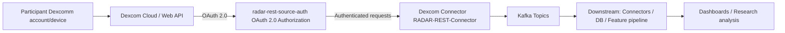
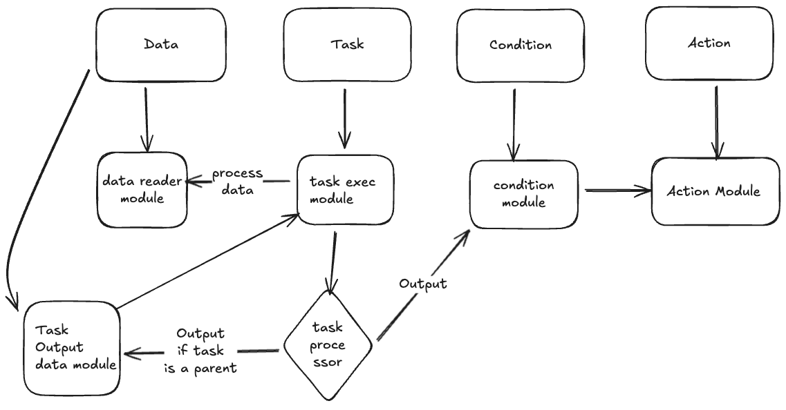
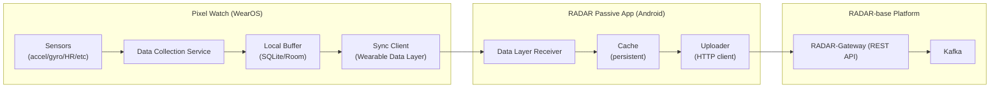

# RADAR-Base Google Summer of Code (GSoC) **2026**

**RADAR-base (Remote Assessment of Disease And Relapses)** is an open source platform that leverages data from wearables and mobile technologies. Below is a list of project ideas.

## Project Ideas

### 1. Dexcomm Continuous Glucose Monitoring (CGM) integration

**Overview**: This project focuses on integrating Dexcomm continuous glucose monitoring data into the RADAR-base ecosystem so that it can be used alongside other wearable and mobile data streams for research and monitoring. The [Dexcom API](https://developer.dexcom.com/docs/) is RESTful and utilizes OAuth 2.0 for authentication, allowing secure authorization of Dexcom CGM data for use in third-party applications.

This work is expected to touch multiple RADAR-base repositories, typically:

- [RADAR-REST-Connector](https://github.com/RADAR-base/RADAR-REST-Connector) (implementing a new REST connector module / routes / converters for the Dexcom API). See oura or fitbit work in this repo for prior similar integrations
- [radar-rest-source-auth](https://github.com/RADAR-base/radar-rest-source-auth) (handling OAuth 2.0 authentication and authorization flows for Dexcom API access). See oura or fitbit work in this repo for prior similar integrations
- [RADAR-Schemas](https://github.com/RADAR-base/RADAR-Schemas) (adding/aligning Avro schemas for Dexcom data streams)
- (Optional) [RADAR-Kubernetes](https://github.com/RADAR-base/RADAR-Kubernetes) (deploying the connector and wiring it into the platform stack)

**Goals:**
The goal is to deliver a production-ready ingestion path for Dexcomm CGM data, following the patterns used for other wearable integrations (e.g. Fitbit, Oura). This integration will enable RADAR-base studies to remotely monitor continuous glucose levels alongside other health metrics, providing researchers with comprehensive multi-modal data streams for longitudinal health monitoring and intervention studies.

By integrating Dexcomm CGM data, RADAR-base studies can track glucose patterns in real-time, correlate glucose levels with other sensor data (activity, sleep, heart rate), and support research into diabetes management, metabolic health, and personalized interventions. This is particularly valuable for studies focusing on chronic disease management, behavioral interventions, and digital therapeutics.

**Workflow (high-level):**

| Milestones                             | Description                                                                                                                                                                                                                                                                                                            |
| -------------------------------------- | ---------------------------------------------------------------------------------------------------------------------------------------------------------------------------------------------------------------------------------------------------------------------------------------------------------------------- |
| Publish Dexcom Schemas                 | Define and publish schemas for the required Dexcomm data types (e.g., estimated glucose values (EGVs), calibrations, alerts, events, device information) following RADAR-base schema conventions.                                                                                                                      |
| Implement connector and auth component | Implement a Dexcomm connector that integrates with the[radar-rest-source-auth](https://github.com/RADAR-base/radar-rest-source-auth) module for OAuth 2.0 authentication, fetches data reliably from the [Dexcom API](https://developer.dexcom.com/docs/), and publishes to Kafka with correct timestamps and deduplication. |
| Validation, security and documentation | Validate data quality, ensure appropriate security/consent flows, and document the integration.                                                                                                                                                                                                                        |

**Required Skills:** Java/Kotlin, REST APIs, OAuth2.0

**Difficulty:** Medium

**Expected Size:** 350-hour (Full time)

**Mentors**: @yatharth, @pauline, @aditya

---

### 2. Support for GCP/GKE in the infrastructure-as-code template

**Overview**: RADAR-base currently provides infrastructure-as-code templates for specific environments. This project aims to extend those templates to support deployment on Google Cloud Platform (GCP) and Google Kubernetes Engine (GKE) in a reproducible, secure, and scalable way. We already support AWS and Azure.

This work is expected to touch the following RADAR-base repository:

- [RADAR-K8s-Infrastructure](https://github.com/RADAR-base/RADAR-K8s-Infrastructure) - A new `gcp` folder should be created in this repo for GCP-specific infrastructure modules.

**Goals:**

The goal is to deliver production-ready infrastructure-as-code for deploying RADAR-base on GCP/GKE, following the patterns established for AWS and Azure deployments. This will enable RADAR-base studies to leverage GCP's managed services for improved reliability, security, and cost optimization.

| Milestones                                  | Description                                                                                       |
| ------------------------------------------- | ------------------------------------------------------------------------------------------------- |
| GCP/GKE architecture and environment design | Define target architecture, networking, security, and required managed services on GCP/GKE.       |
| Implement IaC modules for GCP/GKE           | Add Terraform/Helm/Kubernetes manifests (or similar) for deploying RADAR-base components on GKE.  |
| CI/CD and documentation                     | Add automated deployment/testing workflows and user-facing documentation for GCP/GKE deployments. |

**Scope and Key Tasks:**

- **Kubecost support for GKE**: Enable cost monitoring and optimization through Kubecost integration.
- **Identify minimum RADAR-base components**: Determine the minimum set of radar-base components that need to be deployed.
- **Cost estimation**: Estimate the costs and figure out who is going to pay for the usage.
- **Create accounts for team members**: Set up access for team members to GCP/GKE.
- **Develop Terraform modules for GCP**: Mirror the functionality of existing AWS and Azure modules (VPC/Networking, GKE Cluster, Managed Databases).
- **Alignment with Azure/AWS Patterns**: Follow the established pattern of splitting the IaC into cluster (base infrastructure) and config (DNS, SSL via Cert-Manager, and external-dns) layers.
- **GCP Workload Identity**: Implement GCP Workload Identity to allow GKE pods to securely access GCP services without static service account keys.
- **Managed Service Integration**: Integrate GKE with GCP-native managed services:
  - **Cloud KMS / Secret Manager**: For secure credential handling.
  - **Artifact Registry**: For hosting container images.
  - **Google Cloud Storage (GCS)**: To replace MinIO for long-term data storage and Velero backups.
  - **Cloud SQL (PostgreSQL)**: To replace in-cluster Postgres for better reliability.

**Required Skills:** Terraform, Kubernetes, GCP, Infrastructure-as-Code

**Difficulty:** Medium

**Expected Size:** TBD

**Mentors**: @xibai, @Mani Thumu

---

### 3. New real-time machine learning, inference and interventions pipeline

**Overview**:

RADAR-base is an open-source platform to leverage data from wearable devices and mobile technologies. It provides scalable and customisable capabilities for streaming and processing real-time data remote data from various wearables and apps. The next step for this platform is develop a platform that can utilise this data to execute context based interventions. These interventions can range from single conditional logic to utilising a foundation model to do predictions. In this project, we aim to build a config-driven, easily customisable and scalable just in time intervention platform that can dynamically build and run interventions.

This new just-in-time intervention platform will support configurable DAGs, model training and inference on non-identifiable/synthetic data, and advanced ML/foundation-model use cases, plus realistic sensor simulation for experimentation and reinforcement learning. The more detail about the just in time intervention architecture could be found in this [RFC](https://github.com/RADAR-base/rfcs/blob/jitai/rfcs/platform/0002-just-in-time-intervention-platform.md)

This work is expected to be centred around the [RADAR-Airflow dynamic config repo](https://github.com/RADAR-base/radar-airflow-dynamic-config) where the applicant will contribute to the python library to read the config files and convert it into DAGs which can be executed in Airflow.

**Goals:**

The goal of this project is to implement an extendible dynamic DAG generator module that can convert config files into executable DAGs. The module would support tasks such as detecting missing data, training a machine learning model, running inference in real time and other custom applications.

Once this is achieved, the next aim would be to integrate remotely training AI models. We have previously implemented a prototype to do that in model-builder project. The aim is to expand the architecture to facilitate training and fine tuning of machine learning models. Moreover, we’ll work on deploying the Nvidia Triton server to run inference on the trained machine learning models to conduct context based personalised interventions in real time.

The last leg of the project is to develop a sensor data simulation to generate various wearable data (HR, respiration rate etc) alongside various scenarios such as missing data, spike in heart rate, Atrial fibrillation etc to test latency and efficiency of the intervention system.

#### Just in time intervention architecture

#### High-level DAG from config architecture

| Milestones                                        | Description                                                                                                           |
| ------------------------------------------------- | --------------------------------------------------------------------------------------------------------------------- |
| DAG from configuration                            | Implement a configuration-driven DAG definition and execution layer for the real-time pipeline.            |
| ML / Foundation model support                     | Add support for integrating ML or foundation models (e.g. for prediction, anomaly detection, or feature extraction).  |
| Real-time sensor simulator                        | Build a sensor simulator for reinforcement learning and framework testing, driven by existing datasets and scenarios. |
| Model training on non-identifiable/synthetic data (Optional) | Enable model training using synthetic or anonymised data (e.g. engagement metrics) to preserve privacy.              |
| Adverse-event simulation (Optional)                          | Implement triggers for adverse events (e.g. heart rate, depression-related metrics) as part of the simulator. |

**Required Skills:** Python, streaming frameworks (Kafka/KSQL), ML, MLOps, Apache Airflow

**Difficulty:** Hard

**Expected Size:** 350-hour (Full time)

**Mentors**: [@Hsankesara](https://github.com/hsankesara/), [@afolarin](https://github.com/afolarin)

---

### 4. Researcher Portal Dashboards with AI-Assisted Features

**Overview**: This project will extend an existing RADAR-base Researcher Portal frontend (Next.js + TypeScript) that already includes participant-level and cohort-level data views composed of configurable visualization widgets. The goal is to turn these into first-class, configurable dashboards with AI-assisted assistance for configuring views, choosing metrics, and interpreting data.

RADAR-base is an open-source platform for collecting, managing, and analyzing multimodal data for health research (e.g. wearables, mobile apps, questionnaires). The current prototype Researcher Portal integrates with RADAR-base-compatible APIs to fetch metric metadata and timeseries data (e.g. via a metrics catalogue and `/metrics/timeseries` endpoints) and renders them using an ApexCharts-based visualization layer. Researchers can already switch between participant and cohort views, add per-widget visualizations backed by a shared data service and metric catalogue, select metrics from devices (e.g. steps, heart rate, sleep, calories) and questionnaires, view data as line/bar/area/scatter plots, filter by participant and date range, and persist basic widget configuration in the browser (via `localStorage`).

However, there is no unified dashboard model, no drag-and-drop layout, and only minimal UI guidance for selecting useful metrics or views.

This GSoC project will build on this existing codebase to deliver a more powerful, reusable dashboard framework and introduce AI-assisted UI features that help researchers configure dashboards, pick appropriate visualizations, and explore data more effectively, while keeping the architecture simple and maintainable.

**Goals:**

By the end of the project, the student will:

- Build a reusable dashboard framework that extends the existing widget system, supporting per-study/per-user dashboards with save/load/sharing capabilities beyond `localStorage`.
- Enhance the dashboard UI with drag-and-drop widget layout, optional resizing, and improved widget management, while reusing the existing ApexCharts visualization layer.
- Integrate with existing RADAR-base metrics catalogue and timeseries APIs to support multiple data sources (Fitbit, Garmin, questionnaires) and metrics (heart rate, steps, sleep, adherence scores).
- Implement optional AI-assisted features for suggesting widgets/metrics and smart default dashboards, with a pluggable AI layer that can use open-source LLMs or user-provided API keys.
- Document the dashboard framework, APIs, and AI features for both developers and end users.

| Milestones             | Description                                                                                                                                                |
|------------------------|------------------------------------------------------------------------------------------------------------------------------------------------------------|
| Requirements & design  | Review current participant/cohort dashboards and data services; identify key user workflows, supported data sources, and AI-assisted use cases; design a simple dashboard + widget configuration model and high-level architecture. |
| Dashboard framework    | Refactor existing widget components into a reusable dashboard framework (per-project/per-user configurations, load/save, unified participant vs cohort handling).                                  |
| Dashboard UI & layout (Optional) | Implement the dashboard screen with drag-and-drop widget layout, resizing/full-width options, and improved widget management UI (add/remove/edit) using the existing charting layer.              |
| AI-assisted features (Optional) | Integrate AI-assisted flows for suggesting widgets/metrics and smart default dashboards; optionally add natural-language summaries of selected widgets’ data.                                      |
| Integration & handover | Harden integration with existing RADAR-base APIs (metrics catalogue, timeseries, participants/projects); add tests and write developer + user documentation.                                     |

**Required Skills:** Frontend development (React / Next.js with TypeScript), REST/JSON APIs, basic understanding of data visualization. Familiarity with AI/ML concepts or LLM APIs is beneficial but not required; mentoring will help scope and integrate AI-assisted features safely.

**Difficulty:** Medium–Hard

**Expected Size:** 350-hour (Full time)

**Mentors**: @pauline, @Callum, @yatharth

---

### 5. Improve and modernise the Project website (radar-base.org)

**Overview**: This project aims to modernise the public radar-base.org website, improving content structure, branding, performance, accessibility, and maintainability.

TBD: Add info on the repos/link to existing work (mention wordpress)

**Goals:**

TBD: Add specific goals and what we aim to achieve with this work.
TBD: add any screenshots and things we would like to improve

| Milestones                          | Description                                                                                |
| ----------------------------------- | ------------------------------------------------------------------------------------------ |
| Design and information architecture | Refresh the visual design and content structure to better communicate RADAR-base’s value. |
| Implementation and migration        | Implement the new site (framework/CMS TBD) and migrate existing content.                   |
| Performance, accessibility, SEO     | Optimise the site for performance, accessibility, and discoverability.                     |

**Required Skills:** Modern web frontend framework, UX/design, content management

**Difficulty:** Medium

**Expected Size:** 175-hour (Half time)

**Mentors**: @Wally, @Giada, @Omar, @afolarin

---

### 6. Benchmarking Rings

**Overview**: This project will develop a benchmarking framework (“Benchmarking Rings”) to systematically compare devices, pipelines, or models under controlled conditions. Exact scope is being finalised.

TBD: Add info on the protocols

**Goals:**

TBD: Add specific goals and what we aim to achieve with this work. Link to analysis methods
TBD: add workflow diagram  (if any)

| Milestones                          | Description                                                                            |
| ----------------------------------- | -------------------------------------------------------------------------------------- |
| Define benchmarking scope and tasks | Collaborate with stakeholders (including ZR) to define targets, metrics, and datasets. |
| Implement benchmarking workflows    | Implement reproducible benchmarking workflows and reporting for the agreed scope.      |
| Documentation and reproducibility   | Document how to run, extend, and interpret Benchmarking Rings results.                 |

**Required Skills:** data analysis, benchmarking methodologies, statistical analysis

**Difficulty:** Medium-Hard

**Expected Size:** 350-hour (Full time)

**Mentors**: TBD

---

### 7. Questionnaire app (or other frontend app) UX research and improvements

**Overview**: Focusing on the Questionnaire app (or another key frontend app), this project will investigate performance and engagement, then implement top UX and performance improvements.

TBD: Add info on the repos/link to existing work

**Goals:**

TBD: Add specific goals and what we aim to achieve with this work.
TBD: add any screenshots and things we would like to improve, including any wireframes. Mention the planned plugin architecture

| Milestones                      | Description                                                                                             |
| ------------------------------- | ------------------------------------------------------------------------------------------------------- |
| UX and performance research     | Analyse usage, performance, and engagement data to identify key UX and performance pain points.         |
| Design proposals and prototypes | Propose, prototype, and validate UX and interaction improvements with users/researchers where possible. |
| Implement top improvements      | Implement the highest-impact UX and performance improvements in the chosen frontend app.                |

**Required Skills:** Web/mobile frontend (React/Angular/Flutter), UX research, performance optimization

**Difficulty:** Medium

**Expected Size:** 175-hour (Half time)

**Mentors**: @wally, @giada, @pauline

---

### 8. Automation and Load Testing 

**Overview**: This project will improve performance and reliability testing in the RADAR-base platform by introducing automated load testing and basic anomaly detection for core backend services.

RADAR-base is an open-source platform for collecting, managing, and analyzing multimodal data for health research studies. While the platform includes monitoring and logging, performance regressions and reliability issues are not consistently tested in an automated way.

The project will focus on automating load tests for key RADAR-base services and using Prometheus metrics to detect performance and error anomalies. The primary goal is to make performance regressions visible early and provide maintainers with simple, repeatable testing workflows integrated into CI.

The project will build on existing RADAR-base services and Prometheus-based monitoring, introducing new Gatling-based load tests without adding complex or high-maintenance systems.

This work is expected to touch multiple RADAR-base repositories, typically:

- [radar-gateway](https://github.com/RADAR-base/radar-gateway) (core API gateway and ingress for RADAR-base services, a primary target for load tests and metrics).
- [RADAR-Kubernetes](https://github.com/RADAR-base/RADAR-Kubernetes) (deployment, configuration, and CI/CD integration of the load testing and monitoring workflows).
- [radar-self-enrolment-ui](https://github.com/RADAR-base/radar-self-enrolment-ui) (user-facing flows that can be exercised during end-to-end load and reliability scenarios).

**Goals:**

By the end of the project, the student will:

- Implement automated load tests for RADAR-base core services (Gateway, Hydra, Kratos).
- Collect latency and error metrics using Prometheus during load tests.
- Define simple performance baselines and detect regressions using PromQL.
- Integrate load testing and regression checks into CI/CD pipelines.
- Document how maintainers can run and extend the tests.

**Optional / Stretch (if time permits):**

- Add basic log-based error summaries.
- Provide simple, human-readable explanations for detected regressions.

| Milestones                  | Description                                                                                           |
|-----------------------------|-------------------------------------------------------------------------------------------------------|
| Requirements & design       | Identify target services, load scenarios, and key performance metrics.                               |
| Load test implementation    | Design, implement, and run new Gatling load tests for core services.                                 |
| Metrics & regression checks | Collect Prometheus metrics and define baseline-based regression rules.                               |
| CI integration              | Run load tests and regression checks automatically in CI.                                            |
| Documentation & handover    | Document usage, maintenance, and extension of the testing setup.                                     |

**Required Skills:** Backend development, basic load testing, CI/CD pipelines, Prometheus or metrics-based monitoring.

**Difficulty:** Medium

**Expected Size:** 350-hour (Full time)

**Mentors**: @pauline, @xibai, @Mani Thumu

---

### 9. Pixel Watch 4 data extraction and integration (custom WearOS application)

**Overview**: This project will develop a custom WearOS application for Google Pixel Watch devices to enable continuous data collection through the RADAR-base platform for mobile health research.

RADAR-base is an open-source platform for collecting, managing, and analyzing multimodal data from mobile and wearable devices in health research studies. While RADAR-base currently supports multiple smartphone- and wearable-based data sources, support for WearOS-based smartwatches, particularly Pixel Watch devices, is limited.

Pixel Watches provide access to high-quality physiological and motion sensors (e.g. accelerometer, gyroscope, heart rate, electrodermal activity) which are highly relevant for longitudinal health monitoring. Additionally, WearOS is an attractive development platform for delivering customised smartwatch study apps and allows comprehensive access to sensor APIs.

The project will interact with several existing open-source RADAR-base components, including the Passive RMT App (https://github.com/RADAR-base/radar-prmt-android) and the Kafka Schema repository (https://github.com/RADAR-base/RADAR-Schemas).

**Goals:**

By the end of the project, the student will:

1. Design and implement a custom WearOS application capable of collecting raw and derived sensor data from Pixel Watch devices.

2. Define and document data mappings between WearOS sensor outputs and existing RADAR-base data schemas.

3. Implement secure, reliable data transmission into RADAR-base, either:
  - directly from the watch via HTTP APIs, or

  - indirectly via a companion Android phone application acting as a relay.

4. Validate data quality, robustness, and suitability for real-world research deployments.

5. (Optional/Stretch) Implement basic “active task” functionality on the watch (e.g. short surveys, timed exercises, or simple interventions) to support interactive study protocols.

| Milestones                   | Description                                                                                |
| --------------------------- | ------------------------------------------------------------------------------------------ |
| Requirements & data mapping | Identify target Pixel Watch sensors and map outputs to RADAR-base schemas.                 |
| Architecture & design       | Decide on data transmission architecture and security model; produce design documentation. |
| WearOS app development      | Implement data collection, buffering, and transmission logic on the watch.                 |
| Integration & ingestion     | Integrate with RADAR-base APIs and validate end-to-end data flow.                          |
| Validation & hardening      | Test data quality, battery impact, and robustness for real-world study use.                |
| Documentation & handover    | Write developer and deployment documentation; optional stretch features.                   |

**Required Skills:** Kotlin/Java, WearOS, Android development, mobile sensor APIs

**Difficulty:** Medium-Hard

**Expected Size:** 350-hour (Full time)

**Mentors**: @Callum, @afolarin, Maxime Sasseville

