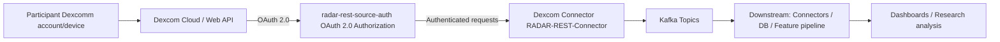
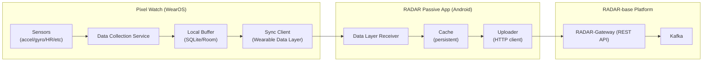

# RADAR-Base Google Summer of Code (GSoC) **2026**

**RADAR-base (Remote Assessment of Disease And Relapses)** is an open source platform that leverages data from wearables and mobile technologies. Below is a list of project ideas.

## Project Ideas

### 1. Dexcomm Continuous Glucose Monitoring (CGM) integration

**Overview**: This project focuses on integrating Dexcomm continuous glucose monitoring data into the RADAR-base ecosystem so that it can be used alongside other wearable and mobile data streams for research and monitoring. The [Dexcom API](https://developer.dexcom.com/docs/) is RESTful and utilizes OAuth 2.0 for authentication, allowing secure authorization of Dexcom CGM data for use in third-party applications.

This work is expected to touch multiple RADAR-base repositories, typically:

- [RADAR-REST-Connector](https://github.com/RADAR-base/RADAR-REST-Connector) (implementing a new REST connector module / routes / converters for the Dexcom API). See oura or fitbit work in this repo for prior similar integrations
- [radar-rest-source-auth](https://github.com/RADAR-base/radar-rest-source-auth) (handling OAuth 2.0 authentication and authorization flows for Dexcom API access). See oura or fitbit work in this repo for prior similar integrations
- [RADAR-Schemas](https://github.com/RADAR-base/RADAR-Schemas) (adding/aligning Avro schemas for Dexcom data streams)
- (Optional) [RADAR-Kubernetes](https://github.com/RADAR-base/RADAR-Kubernetes) (deploying the connector and wiring it into the platform stack) 

**Goals:**
The goal is to deliver a production-ready ingestion path for Dexcomm CGM data, following the patterns used for other wearable integrations (e.g. Fitbit, Oura). This integration will enable RADAR-base studies to remotely monitor continuous glucose levels alongside other health metrics, providing researchers with comprehensive multi-modal data streams for longitudinal health monitoring and intervention studies.

By integrating Dexcomm CGM data, RADAR-base studies can track glucose patterns in real-time, correlate glucose levels with other sensor data (activity, sleep, heart rate), and support research into diabetes management, metabolic health, and personalized interventions. This is particularly valuable for studies focusing on chronic disease management, behavioral interventions, and digital therapeutics.

**Workflow (high-level):**

| Milestones                                      | Description                                                                                       |
|-----------------------------------------------|---------------------------------------------------------------------------------------------------|
| Publish Dexcom Schemas        | Define and publish schemas for the required Dexcomm data types (e.g., estimated glucose values (EGVs), calibrations, alerts, events, device information) following RADAR-base schema conventions.   |
| Implement connector and auth component   | Implement a Dexcomm connector that integrates with the [radar-rest-source-auth](https://github.com/RADAR-base/radar-rest-source-auth) module for OAuth 2.0 authentication, fetches data reliably from the [Dexcom API](https://developer.dexcom.com/docs/), and publishes to Kafka with correct timestamps and deduplication.                |
| Validation, security and documentation        | Validate data quality, ensure appropriate security/consent flows, and document the integration.  |

**Required Skills:** Java/Kotlin, REST APIs, OAuth2.0

**Difficulty:** Medium

**Expected Size:** 350-hour (Full time)

**Mentors**: @yatharth, @pauline, @aditya

---

### 2. Support for GCP/GKE in the infrastructure-as-code template

**Overview**: RADAR-base currently provides infrastructure-as-code templates for specific environments. This project aims to extend those templates to support deployment on Google Cloud Platform (GCP) and Google Kubernetes Engine (GKE) in a reproducible, secure, and scalable way. We already support AWS and Azure.

TBD: Add info on the repos

**Goals:**

TBD: Add specific goals and what we aim to achieve with this work. Link to Azure PR work.
TBD: add architecture diagram (include any managed services)

| Milestones                                    | Description                                                                                                  |
|-----------------------------------------------|--------------------------------------------------------------------------------------------------------------|
| GCP/GKE architecture and environment design   | Define target architecture, networking, security, and required managed services on GCP/GKE.                 |
| Implement IaC modules for GCP/GKE             | Add Terraform/Helm/Kubernetes manifests (or similar) for deploying RADAR-base components on GKE.            |
| CI/CD and documentation                       | Add automated deployment/testing workflows and user-facing documentation for GCP/GKE deployments.           |

**Required Skills:** Terraform, Kubernetes, GCP, Infrastructure-as-Code

**Difficulty:** Medium

**Expected Size:** TBD

**Mentors**: @xibai, @Mani Thumu

---

### 3. New real-time machine learning, inference and interventions pipeline

**Overview**: The new real-time pipeline will support configurable DAGs, model training on non-identifiable/synthetic data, and advanced ML/foundation-model use cases, plus realistic sensor simulation for experimentation and reinforcement learning.

TBD: Add info on the repos

**Goals:**

TBD: Add specific goals and what we aim to achieve with this work. Link to existing realtime work and the RFC.
TBD: add architecture diagram

| Milestones                                      | Description                                                                                                                |
|-----------------------------------------------|----------------------------------------------------------------------------------------------------------------------------|
| DAG from configuration                         | Design and implement a configuration-driven DAG definition and execution layer for the real-time pipeline.                |
| Model training on non-identifiable/synthetic data | Enable model training using synthetic or anonymised data (e.g. engagement metrics) to preserve privacy.               |
| ML / Foundation model support                  | Add support for integrating ML or foundation models (e.g. for prediction, anomaly detection, or feature extraction).      |
| Real-time sensor simulator                     | Build a sensor simulator for reinforcement learning and framework testing, driven by existing datasets and scenarios.      |
| Adverse-event simulation                       | Implement triggers for adverse events (e.g. heart rate, depression-related metrics) as part of the simulator.             |

**Required Skills:** Python, streaming frameworks (Kafka/KSQL), ML, MLOps, Apache Airflow

**Difficulty:** Hard

**Expected Size:** 350-hour (Full time)

**Mentors**: @Heet, @afolarin

---

### 4. Improved backend for Researcher management portal

**Overview**: The Researcher backend will power flexible, interactive tools for researchers, including dashboard and widget-based interfaces with AI-assisted and dynamic UI features.

TBD: Add info on the repos

**Goals:**

TBD: Add specific goals and what we aim to achieve with this work. Link to exisitng old APIs (MP, rest-sources, etc)
TBD: add architecture diagram 

| Milestones                                      | Description                                                                                                        |
|-----------------------------------------------|--------------------------------------------------------------------------------------------------------------------|
| Dashboard / widget framework                   | Design and implement a backend API for configurable dashboards and widget-based layouts.                           |
| AI-based and dynamic UI features               | Explore and implement AI-assisted features (e.g. smart filters, recommendations) and dynamic UI configuration.     |
| Integration with existing RADAR services       | Integrate the new backend components with existing RADAR-base auth, data, and configuration services.              |

**Required Skills:** Java/Kotlin, REST APIs, React, JS/TS, backend architecture

**Difficulty:** Medium-Hard

**Expected Size:** 350-hour (Full time)

**Mentors**: @pauline, @Callum, @yatharth

---

### 5. Improve and modernise the Project website (radar-base.org)

**Overview**: This project aims to modernise the public radar-base.org website, improving content structure, branding, performance, accessibility, and maintainability.

TBD: Add info on the repos/link to existing work (mention wordpress)

**Goals:**

TBD: Add specific goals and what we aim to achieve with this work.
TBD: add any screenshots and things we would like to improve 

| Milestones                           | Description                                                                                 |
|--------------------------------------|---------------------------------------------------------------------------------------------|
| Design and information architecture  | Refresh the visual design and content structure to better communicate RADAR-base’s value.   |
| Implementation and migration         | Implement the new site (framework/CMS TBD) and migrate existing content.                    |
| Performance, accessibility, SEO      | Optimise the site for performance, accessibility, and discoverability.                      |

**Required Skills:** Modern web frontend framework, UX/design, content management

**Difficulty:** Medium

**Expected Size:** 175-hour (Half time)

**Mentors**: @Wally, @Giada, @Omar, @afolarin

---

### 6. Benchmarking Rings

**Overview**: This project will develop a benchmarking framework (“Benchmarking Rings”) to systematically compare devices, pipelines, or models under controlled conditions. Exact scope is being finalised.

TBD: Add info on the protocols

**Goals:**

TBD: Add specific goals and what we aim to achieve with this work. Link to analysis methods
TBD: add workflow diagram  (if any)

| Milestones                           | Description                                                                                      |
|--------------------------------------|--------------------------------------------------------------------------------------------------|
| Define benchmarking scope and tasks  | Collaborate with stakeholders (including ZR) to define targets, metrics, and datasets.          |
| Implement benchmarking workflows     | Implement reproducible benchmarking workflows and reporting for the agreed scope.               |
| Documentation and reproducibility    | Document how to run, extend, and interpret Benchmarking Rings results.                          |

**Required Skills:** data analysis, benchmarking methodologies, statistical analysis

**Difficulty:** Medium-Hard

**Expected Size:** 350-hour (Full time)

**Mentors**: TBD

---

### 7. Questionnaire app (or other frontend app) UX research and improvements

**Overview**: Focusing on the Questionnaire app (or another key frontend app), this project will investigate performance and engagement, then implement top UX and performance improvements.

TBD: Add info on the repos/link to existing work

**Goals:**

TBD: Add specific goals and what we aim to achieve with this work.
TBD: add any screenshots and things we would like to improve, including any wireframes. Mention the planned plugin architecture

| Milestones                                 | Description                                                                                                  |
|--------------------------------------------|--------------------------------------------------------------------------------------------------------------|
| UX and performance research                | Analyse usage, performance, and engagement data to identify key UX and performance pain points.             |
| Design proposals and prototypes            | Propose, prototype, and validate UX and interaction improvements with users/researchers where possible.     |
| Implement top improvements                 | Implement the highest-impact UX and performance improvements in the chosen frontend app.                     |

**Required Skills:** Web/mobile frontend (React/Angular/Flutter), UX research, performance optimization

**Difficulty:** Medium

**Expected Size:** 175-hour (Half time)

**Mentors**: @wally, @giada, @pauline

---

### 8. Automation, load testing, and observability

**Overview**: This project will improve automation around performance and reliability testing, and enhance observability and error analysis (including log scanning and LLM-assisted tooling).

TBD: Add info on the repos/link to existing work (gatling tests, pauline's LLM-assisted bigquery app, etc)

**Goals:**

TBD: Add specific goals and what we aim to achieve with this work.

| Milestones                                        | Description                                                                                                                  |
|---------------------------------------------------|------------------------------------------------------------------------------------------------------------------------------|
| Load testing for core services                    | Design and run automated load tests for gateway, Hydra, and Kratos, integrating them into CI/CD where possible.             |
| Observation tooling and log scanning              | Build or integrate tools for log scanning and observation to detect anomalies and regressions.                              |
| Firebase events error log analysis                | Extend existing Firebase/BigQuery analysis tools (e.g. Pauline’s webapp) for better error and event analysis.               |
| LLM-assisted analysis (e.g. Google AI Studio)     | Explore LLM-based workflows (e.g. via Google AI Studio) for triaging logs and errors and suggesting fixes.                  |

**Required Skills:** Scripting (Python/Bash), observability/monitoring stacks, cloud tooling, load testing frameworks

**Difficulty:** Medium

**Expected Size:** TBD

**Mentors**: @pauline, @xibai, @Mani Thumu

---

### 9. Pixel Watch 4 data extraction and integration (custom WearOS application)

**Overview**: This project will develop a custom WearOS application for Google Pixel Watch devices to enable continuous data collection through the RADAR-base platform for mobile health research.

RADAR-base is an open-source platform for collecting, managing, and analyzing multimodal data from mobile and wearable devices in health research studies. While RADAR-base currently supports multiple smartphone- and wearable-based data sources, support for WearOS-based smartwatches, particularly Pixel Watch devices, is limited.

Pixel Watches provide access to high-quality physiological and motion sensors (e.g. accelerometer, gyroscope, heart rate, electrodermal activity) which are highly relevant for longitudinal health monitoring. Additionally, WearOS is an attractive development platform for delivering customised smartwatch study apps and allows comprehensive access to sensor APIs.

The project will interact with several existing open-source RADAR-base components, including the Passive RMT App (https://github.com/RADAR-base/radar-prmt-android) and the Kafka Schema repository (https://github.com/RADAR-base/RADAR-Schemas).

**Goals:**

By the end of the project, the student will:

1. Design and implement a custom WearOS application capable of collecting raw and derived sensor data from Pixel Watch devices.

2. Define and document data mappings between WearOS sensor outputs and existing RADAR-base data schemas.

3. Implement secure, reliable data transmission into RADAR-base, either:
  - directly from the watch via HTTP APIs, or

  - indirectly via a companion Android phone application acting as a relay.

4. Validate data quality, robustness, and suitability for real-world research deployments.

5. (Optional/Stretch) Implement basic “active task” functionality on the watch (e.g. short surveys, timed exercises, or simple interventions) to support interactive study protocols.

| Milestones                   | Description                                                                                |
| --------------------------- | ------------------------------------------------------------------------------------------ |
| Requirements & data mapping | Identify target Pixel Watch sensors and map outputs to RADAR-base schemas.                 |
| Architecture & design       | Decide on data transmission architecture and security model; produce design documentation. |
| WearOS app development      | Implement data collection, buffering, and transmission logic on the watch.                 |
| Integration & ingestion     | Integrate with RADAR-base APIs and validate end-to-end data flow.                          |
| Validation & hardening      | Test data quality, battery impact, and robustness for real-world study use.                |
| Documentation & handover    | Write developer and deployment documentation; optional stretch features.                   |

**Required Skills:** Kotlin/Java, WearOS, Android development, mobile sensor APIs

**Difficulty:** Medium-Hard

**Expected Size:** 350-hour (Full time)

**Mentors**: @Callum, @afolarin, Maxime Sasseville

