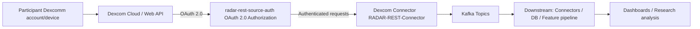

# RADAR-Base Google Summer of Code (GSoC) **2026**

**RADAR-base (Remote Assessment of Disease And Relapses)** is an open source platform that leverages data from wearables and mobile technologies. Below is a list of project ideas.

## Project Ideas

### 1. Dexcomm Continuous Glucose Monitoring (CGM) integration

**Overview**: This project focuses on integrating Dexcomm continuous glucose monitoring data into the RADAR-base ecosystem so that it can be used alongside other wearable and mobile data streams for research and monitoring. The [Dexcom API](https://developer.dexcom.com/docs/) is RESTful and utilizes OAuth 2.0 for authentication, allowing secure authorization of Dexcom CGM data for use in third-party applications.

This work is expected to touch multiple RADAR-base repositories, typically:

- [RADAR-REST-Connector](https://github.com/RADAR-base/RADAR-REST-Connector) (implementing a new REST connector module / routes / converters for the Dexcom API). See oura or fitbit work in this repo for prior similar integrations
- [radar-rest-source-auth](https://github.com/RADAR-base/radar-rest-source-auth) (handling OAuth 2.0 authentication and authorization flows for Dexcom API access). See oura or fitbit work in this repo for prior similar integrations
- [RADAR-Schemas](https://github.com/RADAR-base/RADAR-Schemas) (adding/aligning Avro schemas for Dexcom data streams)
- (Optional) [RADAR-Kubernetes](https://github.com/RADAR-base/RADAR-Kubernetes) (deploying the connector and wiring it into the platform stack) 

**Goals:**
The goal is to deliver a production-ready ingestion path for Dexcomm CGM data, following the patterns used for other wearable integrations (e.g. Fitbit, Oura). This integration will enable RADAR-base studies to remotely monitor continuous glucose levels alongside other health metrics, providing researchers with comprehensive multi-modal data streams for longitudinal health monitoring and intervention studies.

By integrating Dexcomm CGM data, RADAR-base studies can track glucose patterns in real-time, correlate glucose levels with other sensor data (activity, sleep, heart rate), and support research into diabetes management, metabolic health, and personalized interventions. This is particularly valuable for studies focusing on chronic disease management, behavioral interventions, and digital therapeutics.

**Workflow (high-level):**

| Milestones                                      | Description                                                                                       |
|-----------------------------------------------|---------------------------------------------------------------------------------------------------|
| Publish Dexcom Schemas        | Define and publish schemas for the required Dexcomm data types (e.g., estimated glucose values (EGVs), calibrations, alerts, events, device information) following RADAR-base schema conventions.   |
| Implement connector and auth component   | Implement a Dexcomm connector that integrates with the [radar-rest-source-auth](https://github.com/RADAR-base/radar-rest-source-auth) module for OAuth 2.0 authentication, fetches data reliably from the [Dexcom API](https://developer.dexcom.com/docs/), and publishes to Kafka with correct timestamps and deduplication.                |
| Validation, security and documentation        | Validate data quality, ensure appropriate security/consent flows, and document the integration.  |

**Required Skills:** Java/Kotlin, REST APIs, OAuth2.0

**Difficulty:** Medium

**Expected Size:** 350-hour (Full time)

**Mentors**: @yatharth, @pauline, @aditya

---

### 2. Support for GCP/GKE in the infrastructure-as-code template

**Overview**: RADAR-base currently provides infrastructure-as-code templates for specific environments. This project aims to extend those templates to support deployment on Google Cloud Platform (GCP) and Google Kubernetes Engine (GKE) in a reproducible, secure, and scalable way. We already support AWS and Azure.

TBD: Add info on the repos

**Goals:**

TBD: Add specific goals and what we aim to achieve with this work. Link to Azure PR work.
TBD: add architecture diagram (include any managed services)

| Milestones                                    | Description                                                                                                  |
|-----------------------------------------------|--------------------------------------------------------------------------------------------------------------|
| GCP/GKE architecture and environment design   | Define target architecture, networking, security, and required managed services on GCP/GKE.                 |
| Implement IaC modules for GCP/GKE             | Add Terraform/Helm/Kubernetes manifests (or similar) for deploying RADAR-base components on GKE.            |
| CI/CD and documentation                       | Add automated deployment/testing workflows and user-facing documentation for GCP/GKE deployments.           |

**Required Skills:** Terraform, Kubernetes, GCP, Infrastructure-as-Code

**Difficulty:** Medium

**Expected Size:** TBD

**Mentors**: @xibai, @Mani Thumu

---

### 3. New real-time machine learning, inference and interventions pipeline

**Overview**: The new real-time pipeline will support configurable DAGs, model training on non-identifiable/synthetic data, and advanced ML/foundation-model use cases, plus realistic sensor simulation for experimentation and reinforcement learning.

TBD: Add info on the repos

**Goals:**

TBD: Add specific goals and what we aim to achieve with this work. Link to existing realtime work and the RFC.
TBD: add architecture diagram

| Milestones                                      | Description                                                                                                                |
|-----------------------------------------------|----------------------------------------------------------------------------------------------------------------------------|
| DAG from configuration                         | Design and implement a configuration-driven DAG definition and execution layer for the real-time pipeline.                |
| Model training on non-identifiable/synthetic data | Enable model training using synthetic or anonymised data (e.g. engagement metrics) to preserve privacy.               |
| ML / Foundation model support                  | Add support for integrating ML or foundation models (e.g. for prediction, anomaly detection, or feature extraction).      |
| Real-time sensor simulator                     | Build a sensor simulator for reinforcement learning and framework testing, driven by existing datasets and scenarios.      |
| Adverse-event simulation                       | Implement triggers for adverse events (e.g. heart rate, depression-related metrics) as part of the simulator.             |

**Required Skills:** Python, streaming frameworks (Kafka/KSQL), ML, MLOps, Apache Airflow

**Difficulty:** Hard

**Expected Size:** 350-hour (Full time)

**Mentors**: @Heet, @afolarin

---

### 4. Researcher Portal Dashboards with AI-Assisted Features

**Overview**: This project will extend an existing RADAR-base Researcher Portal frontend (Next.js + TypeScript) that already includes participant-level and cohort-level data views composed of configurable visualization widgets. The goal is to turn these into first-class, configurable dashboards with AI-assisted assistance for configuring views, choosing metrics, and interpreting data.

RADAR-base is an open-source platform for collecting, managing, and analyzing multimodal data for health research (e.g. wearables, mobile apps, questionnaires). The current prototype Researcher Portal integrates with RADAR-base-compatible APIs to fetch metric metadata and timeseries data (e.g. via a metrics catalogue and `/metrics/timeseries` endpoints) and renders them using an ApexCharts-based visualization layer. Researchers can already:

- Switch between participant and cohort views.
- Add per-widget visualizations that are backed by a shared data service and metric catalogue.
- Select metrics from devices (e.g. steps, heart rate, sleep, calories) and questionnaires.
- View data as line, bar, area, or scatter plots (e.g. scatter plots for cohort-wide participant distributions over time).
- Filter by participant (including mapping internal IDs to Management Portal logins) and date range.
- Persist basic widget configuration in the browser (via `localStorage`).

However, there is no unified dashboard model, no drag-and-drop layout, and only minimal UI guidance for selecting useful metrics or views.

This GSoC project will build on this existing codebase to deliver a more powerful, reusable dashboard framework and introduce AI-assisted UI features that help researchers configure dashboards, pick appropriate visualizations, and explore data more effectively, while keeping the architecture simple and maintainable.

**Goals:**

By the end of the project, the student will:

- **Generalize and extend the existing widget system**
  - Build on the current participant and cohort “Data Visualization” widgets to define a dashboard model (e.g. per-study, per-user dashboards with multiple widgets).
  - Support saving, loading, and sharing dashboard configurations (beyond browser `localStorage`), so that researchers can return to and reuse their preferred layouts.
  - Unify configuration between participant-level and cohort-level dashboards (e.g. consistent way to select metrics, date ranges, and subjects/cohorts).

- **Enhance the dashboard frontend and layout**
  - Implement a widget-based dashboard UI in Next.js where researchers can:
    - Add/remove widgets using the existing data source + metric selector.
    - Reorder widgets via a drag-and-drop interface.
    - Optionally resize or toggle widgets to full-width (building on the current “fill row” behavior in the cohort view).
  - Reuse and extend the existing ApexCharts-based visualization component to support common research tasks (e.g. time-series trends, cohort distributions, basic comparisons).

- **Leverage the existing metrics catalogue and timeseries APIs**
  - Build on the current `DataService` integration that:
    - Fetches a metric catalogue (grouped by source: devices vs questionnaires).
    - Fetches timeseries data for a selected metric, interval, and optional subject (participant) via API routes that proxy to RADAR-base-compatible backends (e.g. Grafana-backed endpoints).
  - Ensure dashboards can be configured for multiple data sources (e.g. Fitbit, Garmin, questionnaires) and metrics (e.g. heart rate, steps, sleep, adherence scores), using the existing metric identifiers and types.

- **Implement AI-assisted dashboard features**
  - Add AI-assisted configuration flows that use LLMs or simple recommender logic to:
    - Suggest relevant widgets or metrics given:
      - The project’s available data sources and metrics catalogue.
      - The user’s current context (e.g. “participant-level vs cohort-level”, date range).
    - Propose smart default dashboards or “recipes” (e.g. “adherence overview”, “sleep vs activity over last month”).
  - Optionally provide natural-language summaries of the data shown in a widget (e.g. a short text description of trends, outliers, or distributions) to assist non-technical users.
  - Design these features so that the AI layer is optional and pluggable (e.g. can use an open-source LLM or a user-provided API key).

- **Improve data download and management flows (optional stretch)**
  - Build on the existing step-based raw data download flow to integrate it more closely with dashboard selections (e.g. “download the data underlying this chart”).
  - Ensure that dashboard configuration and data download use a consistent concept of projects, participants, devices/sources, and metrics.

- **Document the dashboard framework and AI features**
  - Write developer documentation describing:
    - The dashboard/widget data model.
    - How the metrics catalogue and timeseries APIs are used.
    - How to extend dashboards with new data sources or visualizations.
  - Write user-facing documentation or inline help for researchers on:
    - Creating and managing dashboards.
    - Using AI-assisted suggestions and summaries.
    - Interpreting common types of charts used in the portal.

| Milestones             | Description                                                                                                                                                |
|------------------------|------------------------------------------------------------------------------------------------------------------------------------------------------------|
| Requirements & design  | Review current participant/cohort dashboards and data services; identify key user workflows, supported data sources, and AI-assisted use cases; design a simple dashboard + widget configuration model and high-level architecture. |
| Dashboard framework    | Refactor existing widget components into a reusable dashboard framework (per-project/per-user configurations, load/save, unified participant vs cohort handling).                                  |
| Dashboard UI & layout  | Implement the dashboard screen with drag-and-drop widget layout, resizing/full-width options, and improved widget management UI (add/remove/edit) using the existing charting layer.              |
| AI-assisted features   | Integrate AI-assisted flows for suggesting widgets/metrics and smart default dashboards; optionally add natural-language summaries of selected widgets’ data.                                      |
| Integration & handover | Harden integration with existing RADAR-base APIs (metrics catalogue, timeseries, participants/projects); add tests and write developer + user documentation.                                     |

**Required Skills:** Frontend development (React / Next.js with TypeScript), REST/JSON APIs, basic understanding of data visualization. Familiarity with AI/ML concepts or LLM APIs is beneficial but not required; mentoring will help scope and integrate AI-assisted features safely.

**Difficulty:** Medium–Hard

**Expected Size:** 350-hour (Full time)

**Mentors**: @pauline, @Callum, @yatharth

---

### 5. Improve and modernise the Project website (radar-base.org)

**Overview**: This project aims to modernise the public radar-base.org website, improving content structure, branding, performance, accessibility, and maintainability.

TBD: Add info on the repos/link to existing work (mention wordpress)

**Goals:**

TBD: Add specific goals and what we aim to achieve with this work.
TBD: add any screenshots and things we would like to improve 

| Milestones                           | Description                                                                                 |
|--------------------------------------|---------------------------------------------------------------------------------------------|
| Design and information architecture  | Refresh the visual design and content structure to better communicate RADAR-base’s value.   |
| Implementation and migration         | Implement the new site (framework/CMS TBD) and migrate existing content.                    |
| Performance, accessibility, SEO      | Optimise the site for performance, accessibility, and discoverability.                      |

**Required Skills:** Modern web frontend framework, UX/design, content management

**Difficulty:** Medium

**Expected Size:** 175-hour (Half time)

**Mentors**: @Wally, @Giada, @Omar, @afolarin

---

### 6. Benchmarking Rings

**Overview**: This project will develop a benchmarking framework (“Benchmarking Rings”) to systematically compare devices, pipelines, or models under controlled conditions. Exact scope is being finalised.

TBD: Add info on the protocols

**Goals:**

TBD: Add specific goals and what we aim to achieve with this work. Link to analysis methods
TBD: add workflow diagram  (if any)

| Milestones                           | Description                                                                                      |
|--------------------------------------|--------------------------------------------------------------------------------------------------|
| Define benchmarking scope and tasks  | Collaborate with stakeholders (including ZR) to define targets, metrics, and datasets.          |
| Implement benchmarking workflows     | Implement reproducible benchmarking workflows and reporting for the agreed scope.               |
| Documentation and reproducibility    | Document how to run, extend, and interpret Benchmarking Rings results.                          |

**Required Skills:** data analysis, benchmarking methodologies, statistical analysis

**Difficulty:** Medium-Hard

**Expected Size:** 350-hour (Full time)

**Mentors**: TBD

---

### 7. Questionnaire app (or other frontend app) UX research and improvements

**Overview**: Focusing on the Questionnaire app (or another key frontend app), this project will investigate performance and engagement, then implement top UX and performance improvements.

TBD: Add info on the repos/link to existing work

**Goals:**

TBD: Add specific goals and what we aim to achieve with this work.
TBD: add any screenshots and things we would like to improve, including any wireframes. Mention the planned plugin architecture

| Milestones                                 | Description                                                                                                  |
|--------------------------------------------|--------------------------------------------------------------------------------------------------------------|
| UX and performance research                | Analyse usage, performance, and engagement data to identify key UX and performance pain points.             |
| Design proposals and prototypes            | Propose, prototype, and validate UX and interaction improvements with users/researchers where possible.     |
| Implement top improvements                 | Implement the highest-impact UX and performance improvements in the chosen frontend app.                     |

**Required Skills:** Web/mobile frontend (React/Angular/Flutter), UX research, performance optimization

**Difficulty:** Medium

**Expected Size:** 175-hour (Half time)

**Mentors**: @wally, @giada, @pauline

---

### 8. Automation and Load Testing 

**Overview**: This project will improve performance and reliability testing in the RADAR-base platform by introducing automated load testing and basic anomaly detection for core backend services.

RADAR-base is an open-source platform for collecting, managing, and analyzing multimodal data for health research studies. While the platform includes monitoring and logging, performance regressions and reliability issues are not consistently tested in an automated way.

The project will focus on automating load tests for key RADAR-base services and using Prometheus metrics to detect performance and error anomalies. The primary goal is to make performance regressions visible early and provide maintainers with simple, repeatable testing workflows integrated into CI.

The project will build on existing RADAR-base services and Prometheus-based monitoring, introducing new Gatling-based load tests without adding complex or high-maintenance systems.

This work is expected to touch multiple RADAR-base repositories, typically:

- [radar-gateway](https://github.com/RADAR-base/radar-gateway) (core API gateway and ingress for RADAR-base services, a primary target for load tests and metrics).
- [RADAR-Kubernetes](https://github.com/RADAR-base/RADAR-Kubernetes) (deployment, configuration, and CI/CD integration of the load testing and monitoring workflows).
- [radar-self-enrolment-ui](https://github.com/RADAR-base/radar-self-enrolment-ui) (user-facing flows that can be exercised during end-to-end load and reliability scenarios).

**Goals:**

By the end of the project, the student will:

- Implement automated load tests for RADAR-base core services (Gateway, Hydra, Kratos).
- Collect latency and error metrics using Prometheus during load tests.
- Define simple performance baselines and detect regressions using PromQL.
- Integrate load testing and regression checks into CI/CD pipelines.
- Document how maintainers can run and extend the tests.

**Optional / Stretch (if time permits):**

- Add basic log-based error summaries.
- Provide simple, human-readable explanations for detected regressions.

| Milestones                  | Description                                                                                           |
|-----------------------------|-------------------------------------------------------------------------------------------------------|
| Requirements & design       | Identify target services, load scenarios, and key performance metrics.                               |
| Load test implementation    | Design, implement, and run new Gatling load tests for core services.                                 |
| Metrics & regression checks | Collect Prometheus metrics and define baseline-based regression rules.                               |
| CI integration              | Run load tests and regression checks automatically in CI.                                            |
| Documentation & handover    | Document usage, maintenance, and extension of the testing setup.                                     |

**Required Skills:** Backend development, basic load testing, CI/CD pipelines, Prometheus or metrics-based monitoring.

**Difficulty:** Medium

**Expected Size:** 350-hour (Full time)

**Mentors**: @pauline, @xibai, @Mani Thumu

---

### 9. Pixel Watch 4 data extraction and integration (custom WearOS application)

**Overview**: Develop a custom WearOS application for Pixel Watch 4 to collect relevant sensor data and integrate it into RADAR-base, enabling richer multi-device data collection.

TBD: Add info on the protocols

**Goals:**

TBD: Add specific goals and what we aim to achieve with this work. Link to wearOS docs.
TBD: add arch diagram (if any)

| Milestones                                | Description                                                                                                   |
|-------------------------------------------|---------------------------------------------------------------------------------------------------------------|
| Requirements and data mapping             | Define which Pixel Watch 4 data streams will be collected and how they map to RADAR-base schemas.            |
| WearOS app development                    | Implement the custom WearOS app for data collection and secure transmission.                                 |
| Integration and validation                | Integrate with RADAR-base ingestion, validate data quality, and harden for real-world study deployments.     |

**Required Skills:** Kotlin/Java, WearOS, Android development, mobile sensor APIs

**Difficulty:** Medium-Hard

**Expected Size:** 350-hour (Full time)

**Mentors**: @Callum, @afolarin, Maxime Sasseville
